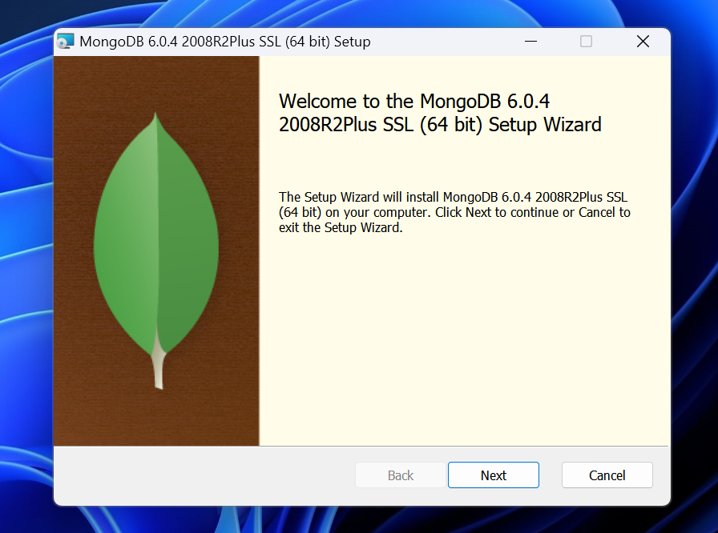
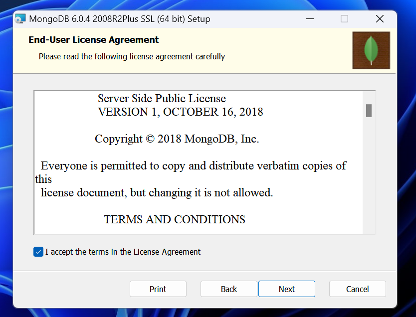
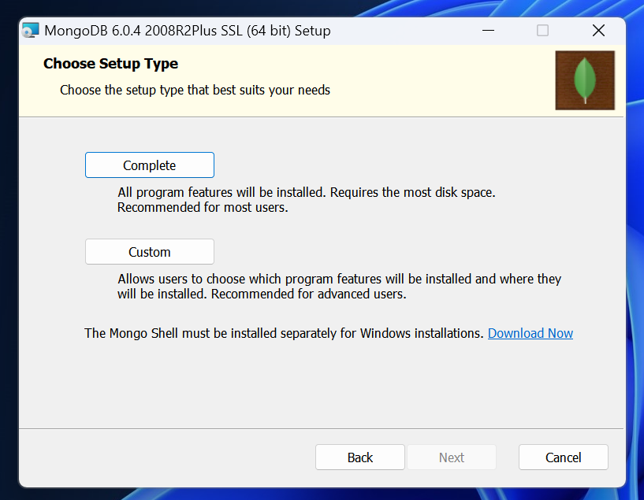
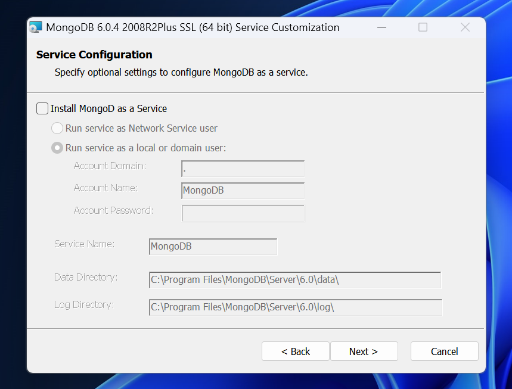
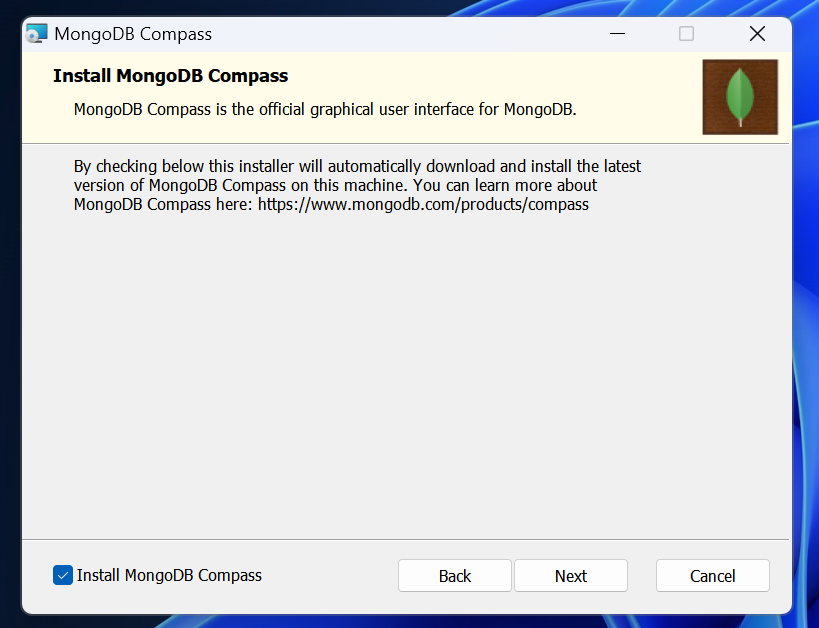
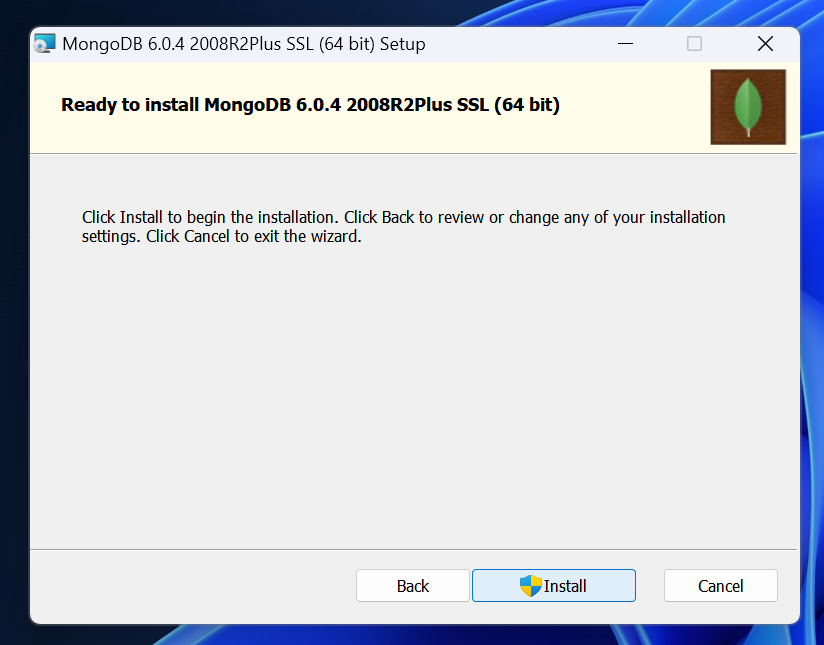
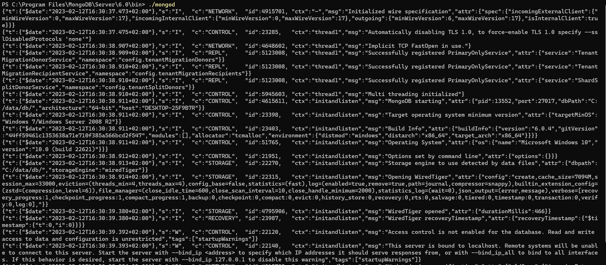
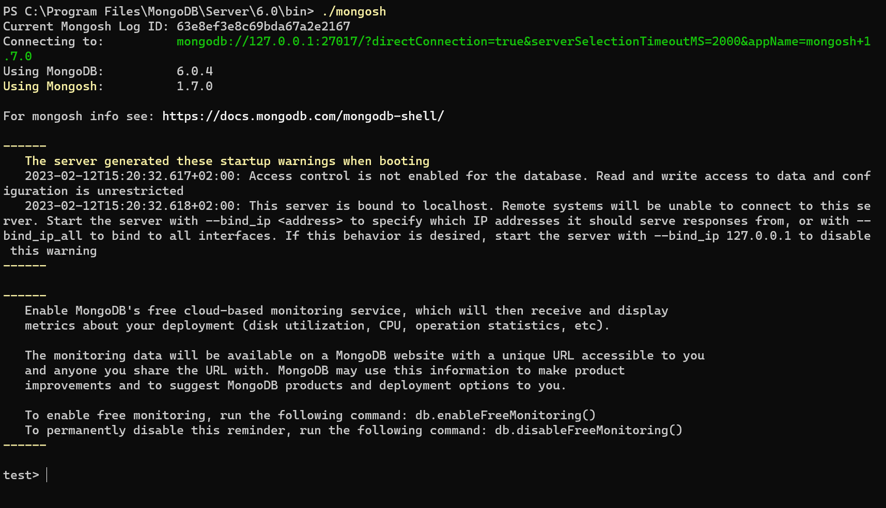
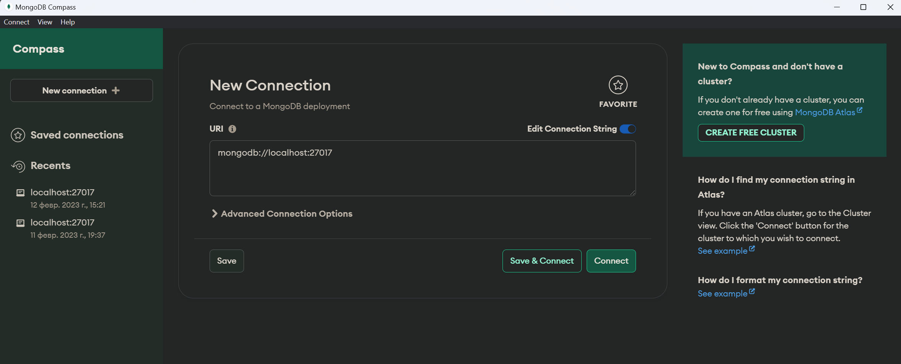
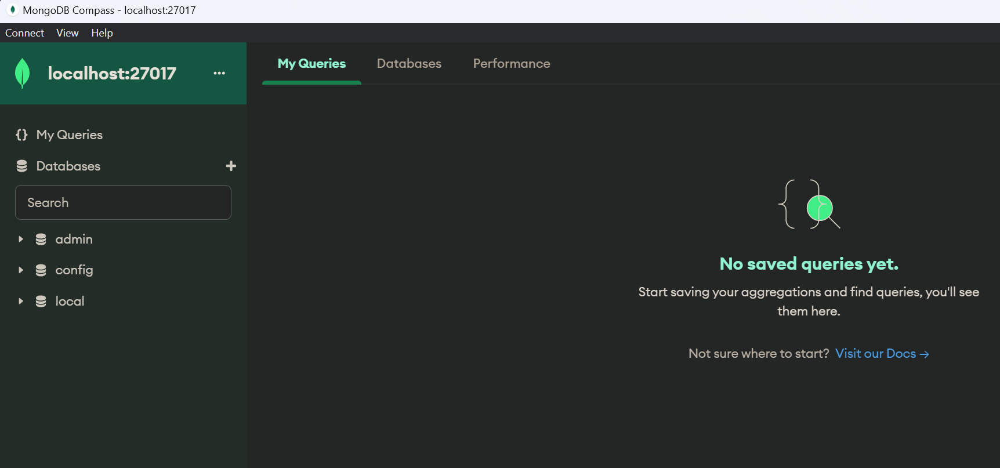

# Практическая работа №1.1. Установка и настройка `MongoDB`

Для установки MongoDB необходимо установить следующие компоненты:

- `MongoDB`
- `MongoDB Shell` (оболочка для работы с базой данных)
- `MongoDB Compass` (графическая оболочка для работы с базой данных)

<details>
<summary> Установка `MongoDB` и `MongoDB Compass` </summary>
      
## Установка `MongoDB` и `MongoDB Compass`

> В лабораторных работах используется `MongoDB` версии `6.0.4`

Для установки MongoDB и MongoDB Compass необходимо скачать файл утановки с официального сайта MongoDB: https://www.mongodb.com/try/download/community.

Далее необходимо запустить скачанный файл установки `mongodb-windows-x86_64-6.0.4-signed`.

В открытом окне нажимаем `Next`



Устанавливаем галочку для пункта `I accept the terms in the License Agreement` и нажимаем `Next`



Выбираем тип установки `Complete`



Убираем галочку для пункта `Install MongoDB as a Servise` и нажимаем `Next`



Далее нам будет предложено установить `MongoDB Compass`. Устанавливаем галочку для пункта `Install MongoDB Compass` и нажимаем next



Подтверждаем установку, нажав на кнопку `Install`



После процесса установки нам будет выведенно соответствующее оповещение.


## Установка `MongoDB Shell`

`MongoDB Shell` не входит в стандартный пакет установки `MongoDB` и поэтому его нужно установить отдельно.

Для этого необходимо скачать архив с того же официального сайта: https://www.mongodb.com/try/download/shell .

Из данного архива нам необходим только файл `mongosh.exe`. Рекомендую его скопировать в ту же директорию, где находится и сам `MongoDB`: `C:\Program Files\MongoDB\Server\6.0\bin\`

## Настройка `MongoDB`

БД `MongoDB` неоходимо создать папку, в которой будут храниться данные. Для этого необходимо выполнить следующие шаги:

1. Создать директорию `mongo_db\data`:

```shell
 mkdir "C:\data\db"
```

2. Далее переходим в директорию, где установлено приложение `mongod`:

```shell
cd "C:\Program Files\MongoDB\Server\6.0\bin"
```

3. Вызываем команду для указания приложению папки для хранения данных:

> :warning: При первом запуске приложения `mongod.exe` может появиться предупреждение об опасности данного файла, т.к. по умолчанию в системе Windos запрещен запуск сценариев (скриптов).

```shell
./mongod.exe --dbpath="C:\data\db"
```

## Запуск сервера MongoDB

Для запуска сервера MongoDB необходимо запустить приложение mongod:

```shell
./mongod.exe
```

После чего будут выведены логи БД



## Подключение к серверу MongoDB с попощью `MongoDB Shell`:

> :warning: Перед подключением не забудте запустить сервер MongoDB.

Для подключения к серверу запустите mongosh, находящиеся в `C:\Program Files\MongoDB\Server\6.0\bin\`.

```shell
./mongosh
```

> При первом запуске mongosh программа может запросить строку подключения к БД. Необходимо просто нажать Enter.

После запуска mongosh и подключения к БД мы получаем доступ к выполнению различных команд, с помощью терминала.



## Подключение к серверу MongoDB с попощью `MongoDB Compass`:

Для подключения к серверу запустите приложение  `MongoDB Compass`.



Используем строку подключения по умолчанию (`mongodb://localhost:27017`) и нажимем `Connect`.

После чего мы получаем доступ к бд и должны видеть 3 базы по уполчанию:

- `admin`
- `config`
- `local`



</details>

## Задание на практическую работу №1.1. Установка и настройка `MongoDB`

1. Установить MongoDB
2. Установить графическую оболочку `MongoDB Compas` и `MongoDB Shell`
3. Запустить сервер `MongoDB`
4. Создать БД с названием `19IS`
5. В `19IS` создать коллекцию main_collection
6. В коллекции создать документ, в котором будет следующие поля: `first_name`, `last_name`.

---

[Решение к практической работе №1.1.](../solutions/lab_1/lab_1_solution.md)

# Практическая работа № 1.2. Знакомство с консолью `MongoDB` и способами взаимодействия с БД

## Задание на практическую работу

1. Произведите подключение к тестовой базе данных
2. Добавьте произвольные данные в базу данных с использованием командной строки
3. Извлеките добавленные на предыдущем шаге данные с помощью командной строки
4. Задание 4. Добавьте произвольные данные в базу данных с использованием `MongoDB Compass`

---

[Решение к практической работе №1.2.](../solutions/lab_2/lab_2_solution.md)

# Практическая работа  № 1.3. Форматы обмена данным в `MongoDB`. Моделирование данных

## Задание на практическую работу

1. Составить схему РБД в соответствии с вашим вариантом.
2. Создать БД по созданной вами схеме в любой СУБД.
3. Заполнить базу данных произвольными данными.
4. Представить созданную на предыдущем шаге БД в нереляционном
виде, записанную в `JSON`.

### Варианты индивидуальных заданий

1. Фирма, торгующая автомобилями.
2. Магазин, торгующий цифровыми фотоаппаратами.
3. Фирма, занимающаяся производством USB-гаджетов.
4. Предприятие, производящее аудио-системы.
5. Магазин, торгующий ноутбуками.
6. Предприятие, содержащее парк самолетов.
7. Магазин программного обеспечения.
8. Производитель кухонной техники.
9. Дистрибьютор мотоциклов.
10. Магазин компьютерной периферии.
11. Магазин одежды.
12. Интернет-магазин наручных часов.
13. Магазин, специализирующийся на планшетных компьютерах.
14. Магазин спортивных велосипедов.
15. Фирма по установке климатической техники.
16. Подразделение банка, хранящее информацию о держателях банковских карт.
17. Фирма, специализирующаяся фотоаппаратов.
18. Ювелирный магазин.
19. Фирма по продаже скутеров.
20. Магазин обуви.
21. Производитель моноблоков.
22. Магазин по продаже телевизоров.
23. Поставщик бытовой техники.
24. Арендодатель игровых приставок.
25. Магазин спортивных товаров.

---

[Решение к практической работе №3 (Вариант 5)](../solutions/lab_3/lab_3_solution.md)

# Практическая работа № 1.4. Документы и индексы в в `MongoDB`

## Задание на практическую работу

1. Создайте базу данных, с которой вы в дальнейшем будете работать
2. Создайте коллекцию, в которой у вас будут храниться документы.
3. Наполните коллекцию документами в соответствии с вашим индивидуальным вариантом (см. Практическая работа №3). Создайте не менее 10 документов. Документы коллекции должны содержать, по крайней мере, один массив, и один  вложенный документ.
4. Создайте составной и полнотекстовый индексы для документов в вашей коллекции.
5. Создайте запрос, производящий замену документа.
6. Создайте запрос, производящий обновление любого поля документа и запрос, добавляющий в него новые поля.
7. Создайте запрос для получения всех документов коллекции и определите, используется ли для него индекс.

---

[Решение к практической работе №4 (Вариант 5)](../solutions/lab_4/lab_4_solution.md)

# Практическая работа №1.5. Запросы и запросы с условием `MongoDB`

## Задание на практическую работу

1. Создайте пару простых запросов для выборки данных из БД.
2. Создайте сложные запросы с каждым из перечисленных модификаторов.
3. Создайте запросы с использованием методов сортировки, ограничения и пропуска данных.
4. Всего у вас должно получиться не менее десяти уникальных запросов.

---

[Решение к практической работе №5](../solutions/lab_5/lab_5_solution.md)

# Лабораторная работа №1.6. Запросы: модификаторы массивов. Позиционные модификаторы массивов

## Задание на лабораторную работу

1. Создайте несколько запросов для вставки данных в массив.
2. Создайте запросы, производящие обновление данных в массиве: как по позиции элемента в массиве, так и по его значению.
3. Создайте запросы, удаляющие элементы из массива: по позиции элемента в массиве и по его значению.

--- 

[Решение к лабораторной работе №6](../solutions/lab_6/lab_6_solution.md)


