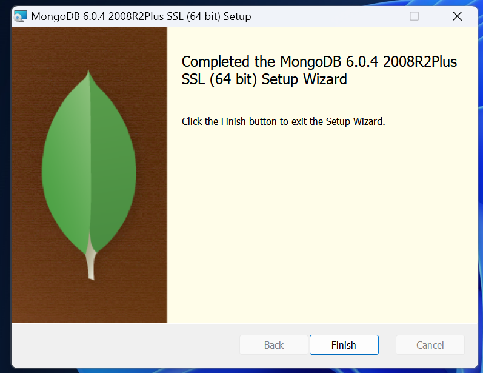

# Практическая работа 1. "Установка и настройка нереляционной СУБД".

## №1.1. Установка и настройка `MongoDB`

Для установки MongoDB необходимо установить следующие компоненты:

- `MongoDB`
- `MongoDB Shell` (оболочка для работы с базой данных)
- `MongoDB Compass` (графическая оболочка для работы с базой данных)

<details>
<summary> Установка `MongoDB` и `MongoDB Compass` </summary>
      
## Установка `MongoDB` и `MongoDB Compass`

> В лабораторных работах используется `MongoDB` версии `6.0.4`

Для установки MongoDB и MongoDB Compass необходимо скачать файл утановки с официального сайта MongoDB: https://www.mongodb.com/try/download/community.

Далее необходимо запустить скачанный файл установки `mongodb-windows-x86_64-6.0.4-signed`.

В открытом окне нажимаем `Next`


Устанавливаем галочку для пункта `I accept the terms in the License Agreement` и нажимаем `Next`


Выбираем тип установки `Complete`


Убираем галочку для пункта `Install MongoDB as a Servise` и нажимаем `Next`


Далее нам будет предложено установить `MongoDB Compass`. Устанавливаем галочку для пункта `Install MongoDB Compass` и нажимаем next


Подтверждаем установку, нажав на кнопку `Install`


После процесса установки нам будет выведенно соответствующее оповещение.



## Установка `MongoDB Shell`

`MongoDB Shell` не входит в стандартный пакет установки `MongoDB` и поэтому его нужно установить отдельно.

Для этого необходимо скачать архив с того же официального сайта: https://www.mongodb.com/try/download/shell .

Из данного архива нам необходим только файл `mongosh.exe`. Рекомендую его скопировать в ту же директорию, где находится и сам `MongoDB`: `C:\Program Files\MongoDB\Server\6.0\bin\`

## Настройка `MongoDB`

БД `MongoDB` неоходимо создать папку, в которой будут храниться данные. Для этого необходимо выполнить следующие шаги:

1. Создать директорию `mongo_db\data`:

```shell
 mkdir "C:\data\db"
```

2. Далее переходим в директорию, где установлено приложение `mongod`:

```shell
cd "C:\Program Files\MongoDB\Server\6.0\bin"
```

3. Вызываем команду для указания приложению папки для хранения данных:

> :warning: При первом запуске приложения `mongod.exe` может появиться предупреждение об опасности данного файла, т.к. по умолчанию в системе Windos запрещен запуск сценариев (скриптов).

```shell
./mongod.exe --dbpath="C:\data\db"
```

## Запуск сервера MongoDB

Для запуска сервера MongoDB необходимо запустить приложение mongod:

```shell
./mongod.exe
```

После чего будут выведены логи БД


## Подключение к серверу MongoDB с попощью `MongoDB Shell`:

> :warning: Перед подключением не забудте запустить сервер MongoDB.

Для подключения к серверу запустите mongosh, находящиеся в `C:\Program Files\MongoDB\Server\6.0\bin\`.

```shell
./mongosh
```

> При первом запуске mongosh программа может запросить строку подключения к БД. Необходимо просто нажать Enter.

После запуска mongosh и подключения к БД мы получаем доступ к выполнению различных команд, с помощью терминала.


## Подключение к серверу MongoDB с попощью `MongoDB Compass`:

Для подключения к серверу запустите приложение  `MongoDB Compass`.


Используем строку подключения по умолчанию (`mongodb://localhost:27017`) и нажимем `Connect`.

После чего мы получаем доступ к бд и должны видеть 3 базы по уполчанию:

- `admin`
- `config`
- `local`


</details>

## Задание на практическую работу №1.1. Установка и настройка `MongoDB`

1. Установить MongoDB
2. Установить графическую оболочку `MongoDB Compas` и `MongoDB Shell`
3. Запустить сервер `MongoDB`
4. Создать БД с названием `19IS`
5. В `19IS` создать коллекцию main_collection
6. В коллекции создать документ, в котором будет следующие поля: `first_name`, `last_name`.

---

[Решение к практической работе №1.1.](../solutions/lab_1/lab_1_solution.md)

# № 1.2. Знакомство с консолью `MongoDB` и способами взаимодействия с БД

## Задание на практическую работу № 1.2.

1. Произведите подключение к тестовой базе данных
2. Добавьте произвольные данные в базу данных с использованием командной строки
3. Извлеките добавленные на предыдущем шаге данные с помощью командной строки
4. Задание 4. Добавьте произвольные данные в базу данных с использованием `MongoDB Compass`

---

[Решение к практической работе №1.2.](../solutions/lab_2/lab_2_solution.md)


# Критерии оценки работы 

### 1. **Установка и настройка MongoDB (5 баллов)**

- **0-1 балл**: Установка MongoDB не выполнена или выполнена с ошибками.
- **2-3 балла**: Установка MongoDB выполнена, но возникли незначительные ошибки или недочеты при установке MongoDB Shell и Compass.
- **4-5 баллов**: MongoDB и все необходимые компоненты (MongoDB Shell и MongoDB Compass) установлены корректно, сервер MongoDB успешно запущен.


### 2. **Создание базы данных и коллекции в MongoDB (4 балла)**

- **0-1 балл**: Не удалось создать базу данных или коллекцию.
- **2-3 балла**: База данных создана, но с ошибками в названии или в структуре коллекции.
- **4 балла**: База данных `MGPU_you_id` и коллекция `main_collection` созданы корректно, документ с полями `first_name`, `last_name` добавлен.


### 3. **Знакомство с консолью MongoDB и использование команд (5 баллов)**

- **0-1 балл**: Студент не может подключиться к базе данных или использовать базовые команды MongoDB.
- **2-3 балла**: Подключение к базе данных выполнено, но ошибки или недочеты при добавлении и извлечении данных.
- **4-5 баллов**: Студент успешно подключился к базе данных, добавил и извлек данные с использованием командной строки.


### 4. **Использование MongoDB Compass для добавления данных (3 балла)**

- **0-1 балл**: MongoDB Compass не был использован или использован с ошибками.
- **2 балла**: MongoDB Compass используется, но добавление данных выполнено не совсем корректно.
- **3 балла**: Студент успешно использует MongoDB Compass для добавления данных в базу данных, без ошибок.


### 5. **Документация и отчетность (3 балла)**

- **0-1 балл**: Отсутствует отчет или отчет не содержит описания всех шагов.
- **2 балла**: Отчет описывает шаги, но некоторые моменты не достаточно детализированы.
- **3 балла**: Отчет четко и подробно описывает все шаги работы, объясняя решения и методы.


### **Итоговая оценка: 20 баллов**

- **18-20 баллов**: Отлично – все этапы работы выполнены без ошибок, работа логично структурирована.
- **14-17 баллов**: Хорошо – выполнены основные этапы работы, но есть небольшие ошибки или недочеты.
- **10-13 баллов**: Удовлетворительно – работа выполнена с ошибками или неполно.
- **0-9 баллов**: Неудовлетворительно – работа не завершена или выполнена с серьезными ошибками.
