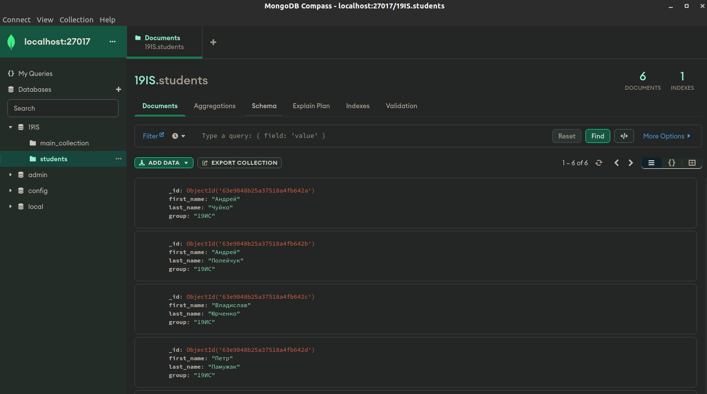
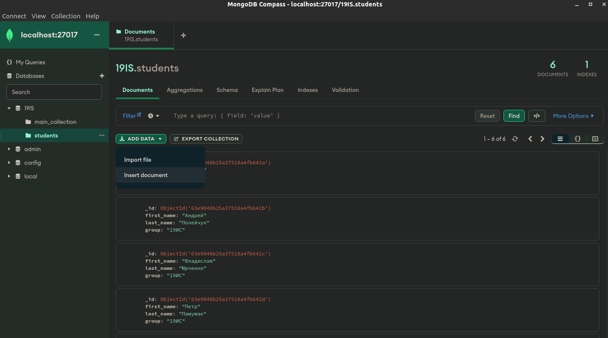
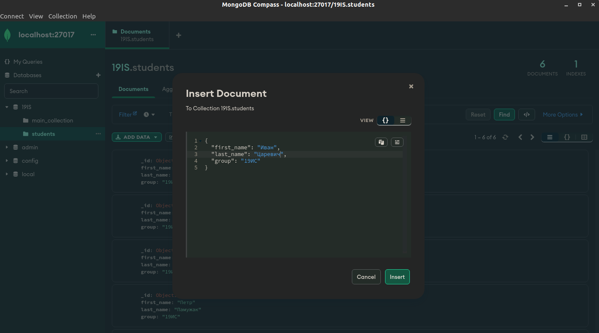
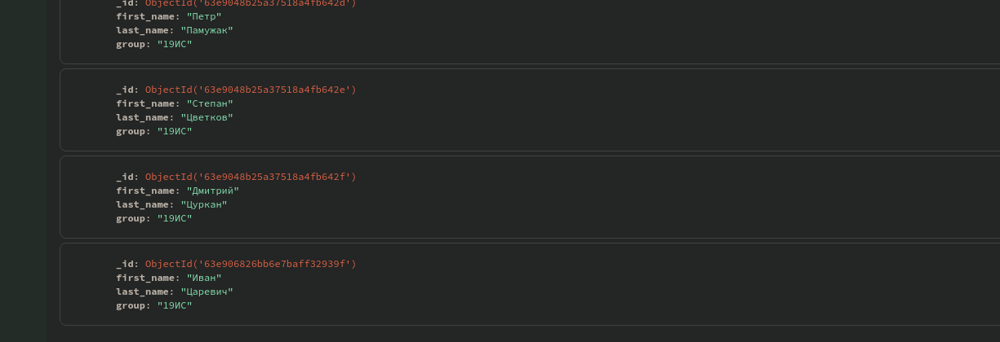

# Решение к Лабораторной работе №2. Знакомство с консолью `MongoDB` и способами взаимодействия с БД

## Задание 1. Произведите подключение к тестовой базе данных.

Подключение к базе данных описано в [Лабораторной работе №1](../../labs/lab_1.md)

## Задание 2. Добавьте произвольные данные в базу данных с использованием командной строки.

> Перед выполнением создайте БД с названием 19IS

Создадим новую коллекцию `students`, в которой будут находиться документы с информацией о студентах.

```shell
use 19IS;

db.createCollection("students");
```

Добавим документ для каждого студента. Выполним данное действие с помощью команды `db.collection.insertMany()`:

```shell
db.students.insertMany([{
    "first_name": "Андрей",
    "last_name": "Чуйко",
    "group": "19ИС"
  },
    {
    "first_name": "Андрей",
    "last_name": "Полейчук",
    "group": "19ИС"
  },
    {
    "first_name": "Владислав",
    "last_name": "Юрченко",
    "group": "19ИС"
  },
    {
    "first_name": "Петр",
    "last_name": "Памужак",
    "group": "19ИС"
  },
    {
    "first_name": "Степан",
    "last_name": "Цветков",
    "group": "19ИС"
  },
    {
    "first_name": "Дмитрий",
    "last_name": "Цуркан",
    "group": "19ИС"
  }
]);
```

После применения команды будет выведенно сообщение о том, что было создано 6 документов. Причем поле `_id` установится автоматически:

```shell
{
  acknowledged: true,
  insertedIds: {
    '0': ObjectId("63e9048b25a37518a4fb642a"),
    '1': ObjectId("63e9048b25a37518a4fb642b"),
    '2': ObjectId("63e9048b25a37518a4fb642c"),
    '3': ObjectId("63e9048b25a37518a4fb642d"),
    '4': ObjectId("63e9048b25a37518a4fb642e"),
    '5': ObjectId("63e9048b25a37518a4fb642f")
  }
}
```

## Задание 3. Извлеките добавленные на предыдущем шаге данные с помощью командной строки

Для всех извлечения данных, созданных в предыдущем шаге используем команду `db.collection.find()`
```shell
db.students.find();
```

После выполнения нам будет выведен список документов:

```shell
[
  {
    _id: ObjectId("63e9048b25a37518a4fb642a"),
    first_name: 'Андрей',
    last_name: 'Чуйко',
    group: '19ИС'
  },
  {
    _id: ObjectId("63e9048b25a37518a4fb642b"),
    first_name: 'Андрей',
    last_name: 'Полейчук',
    group: '19ИС'
  },
  {
    _id: ObjectId("63e9048b25a37518a4fb642c"),
    first_name: 'Владислав',
    last_name: 'Юрченко',
    group: '19ИС'
  },
  {
    _id: ObjectId("63e9048b25a37518a4fb642d"),
    first_name: 'Петр',
    last_name: 'Памужак',
    group: '19ИС'
  },
  {
    _id: ObjectId("63e9048b25a37518a4fb642e"),
    first_name: 'Степан',
    last_name: 'Цветков',
    group: '19ИС'
  },
  {
    _id: ObjectId("63e9048b25a37518a4fb642f"),
    first_name: 'Дмитрий',
    last_name: 'Цуркан',
    group: '19ИС'
  }
]
```

## Задание 4. Добавьте произвольные данные в базу данных с использованием `MongoDB Compass`

Для выполнения данного задания, добавим еще одного студента в коллекцию `students`.



Для добавления нового документа необходимо нажать на `ADD DATA` и выбрать `Insert document`:



Далее добавляем необходимые поля для документа и после этого нажимаем `Insert`:



После чего в коллекции `students` должен появиться новый документ:

