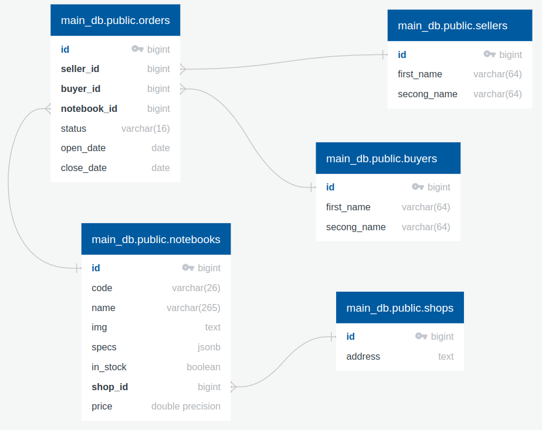
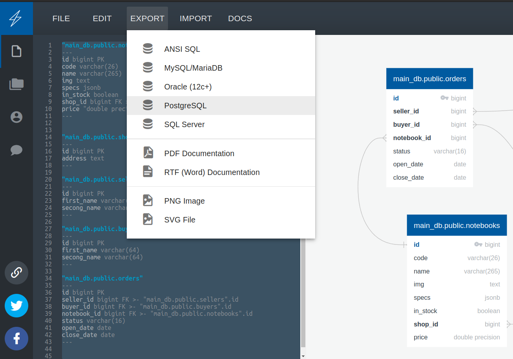
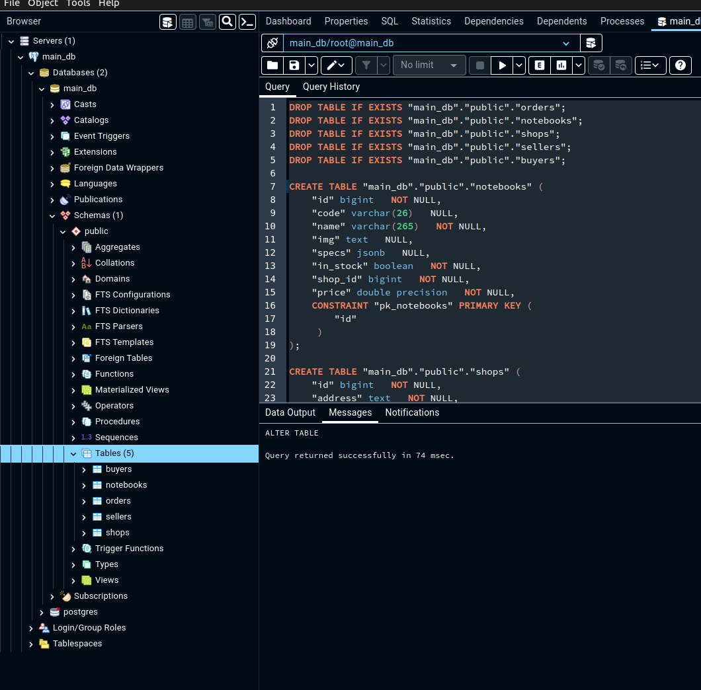
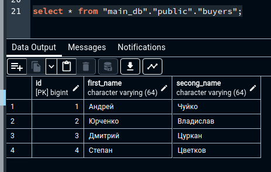
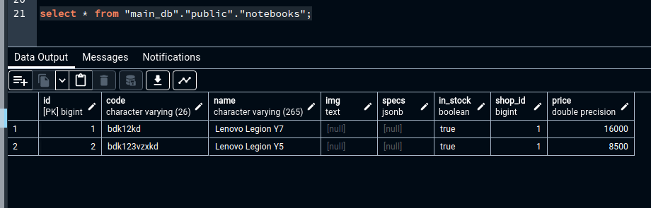

# Решение к Лабораторной работе №2.1. Форматы обмена данным в MongoDB. Моделирование данных

> **Note**: Данное решение представлено для варианта №5 - Магазин, торгующий ноутбуками.

## Задание 1. Составить схему РБД в соответствии с вашим вариантом.

> **Note**: Для моделирования схемы реляционной базы данных можно использовать инструмент [QuickDBB](https://www.quickdatabasediagrams.com/). Это веб приложение для создания диаграмм БД. Бесплатная версия дает возможность создать схему для одной БД, что вполне достаточно в рамках данного курса.

Схем БД магазина, торгующим ноутбуками выглядит следующим образом:



В данной бд представлено 5 таблиц:

- Магазины (shops)
    - id - идентификатор магазина
    - address - адрес магазина
- Ноутбуки (notebooks)
  - id - идентификатор ноутбука
  - code - код ноутбука
  - name - название ноутбука
  - img - ссылка на картинку ноутбука
  - specs - json, хранящий характеристики ноутбука (`{характеристика_1: значение_1, характеристика_2: значение_2}`)
  - in_stock - наличие ноутбука
  - shop_id - внешний ключ на таблицу `shops` по полю `id`
  - price - цена ноутбука
- Продавцы (sellers)
  - id - идентификатор продавца
  - first_name - имя продавца
  - second_name - фамилия продавца
- Покупатели (buyers)
  - id - идентификатор покупателя
  - first_name - имя покупателя
  - second_name - фамилия покупателя
- Заказы (orders)
  - id - идентификатор заказа
  - seller_id - внешний ключ на таблицу `sellers` по полю `id`
  - buyer_id - внешний ключ на таблицу `buyers` по полю `id`
  - notebook_id - внешний ключ на таблицу `notebooks` по полю `id`
  - status - статус заказа (например, обрабатывается, доставляется, закрыт, отменен и т.д.)
  - open_date - дата открытия заказа
  - close_date - дата закрытия заказа

Код для создания данной схемы:

```shell
"main_db.public.notebooks"
---
id bigint PK
code varchar(26) null
name varchar(265)
img text null
specs jsonb null
in_stock boolean
shop_id bigint FK >- "main_db.public.shops".id
price "double precision"
---


"main_db.public.shops"
---
id bigint PK
address text
---

"main_db.public.sellers"
---
id bigint PK
first_name varchar(64)
secong_name varchar(64)
---

"main_db.public.buyers"
---
id bigint PK
first_name varchar(64)
secong_name varchar(64)
---

"main_db.public.orders"
---
id bigint PK
seller_id bigint FK >- "main_db.public.sellers".id
buyer_id bigint FK >- "main_db.public.buyers".id
notebook_id bigint FK >- "main_db.public.notebooks".id
status varchar(16)
open_date date
close_date date null
---
```

## Задание 2. Создать БД по созданной вами схеме в любой СУБД.

Если вы использовали инструмент [QuickDBB](https://www.quickdatabasediagrams.com/), то после создания схемы можно сразу получить сгенерированный запрос на создание таблиц и связей между ними. Для этого нужно нажать на кнопку `EXPORT` и выбрать тип СУБД.



После загрузки файла с командами откройте его, скопируйте все его содержимое и выполните запрос в вашей СУБД

```sql
DROP TABLE IF EXISTS "main_db"."public"."orders";
DROP TABLE IF EXISTS "main_db"."public"."notebooks";
DROP TABLE IF EXISTS "main_db"."public"."shops";
DROP TABLE IF EXISTS "main_db"."public"."sellers";
DROP TABLE IF EXISTS "main_db"."public"."buyers";

CREATE TABLE "main_db"."public"."notebooks" (
    "id" bigint   NOT NULL,
    "code" varchar(26)   NULL,
    "name" varchar(265)   NOT NULL,
    "img" text   NULL,
    "specs" jsonb   NULL,
    "in_stock" boolean   NOT NULL,
    "shop_id" bigint   NOT NULL,
    "price" double precision   NOT NULL,
    CONSTRAINT "pk_notebooks" PRIMARY KEY (
        "id"
     )
);

CREATE TABLE "main_db"."public"."shops" (
    "id" bigint   NOT NULL,
    "address" text   NOT NULL,
    CONSTRAINT "pk_shops" PRIMARY KEY (
        "id"
     )
);

CREATE TABLE "main_db"."public"."sellers" (
    "id" bigint   NOT NULL,
    "first_name" varchar(64)   NOT NULL,
    "secong_name" varchar(64)   NOT NULL,
    CONSTRAINT "pk_sellers" PRIMARY KEY (
        "id"
     )
);

CREATE TABLE "main_db"."public"."buyers" (
    "id" bigint   NOT NULL,
    "first_name" varchar(64)   NOT NULL,
    "secong_name" varchar(64)   NOT NULL,
    CONSTRAINT "pk_buyers" PRIMARY KEY (
        "id"
     )
);

CREATE TABLE "main_db"."public"."orders" (
    "id" bigint   NOT NULL,
    "seller_id" bigint   NOT NULL,
    "buyer_id" bigint   NOT NULL,
    "notebook_id" bigint   NOT NULL,
    "status" varchar(16)   NOT NULL,
    "open_date" date   NOT NULL,
    "close_date" date   NULL,
    CONSTRAINT "pk_orders" PRIMARY KEY (
        "id"
     )
);

ALTER TABLE "main_db"."public"."notebooks" ADD CONSTRAINT "fk_notebooks_shop_id" FOREIGN KEY("shop_id")
REFERENCES "main_db"."public"."shops" ("id");

ALTER TABLE "main_db"."public"."orders" ADD CONSTRAINT "fk_orders_seller_id" FOREIGN KEY("seller_id")
REFERENCES "main_db"."public"."sellers" ("id");

ALTER TABLE "main_db"."public"."orders" ADD CONSTRAINT "fk_orders_buyer_id" FOREIGN KEY("buyer_id")
REFERENCES "main_db"."public"."buyers" ("id");

ALTER TABLE "main_db"."public"."orders" ADD CONSTRAINT "fk_orders_notebook_id" FOREIGN KEY("notebook_id")
REFERENCES "main_db"."public"."notebooks" ("id");

```

После выполнения запроса в базе `main_db` схеме `public` появятся 5 таблиц



## Задание 3. Заполнить базу данных произвольными данными.

Для заполнения базы данных произвольными данными выполним следующий запрос:

```sql
INSERT INTO "main_db"."public"."shops" VALUES 
(1, 'ул. Пушкина, д. Кукушкино 534');

INSERT INTO "main_db"."public"."sellers" VALUES 
(1, 'Андрей', 'Полейчук'),
(2, 'Петр', 'Памужак');

INSERT INTO "main_db"."public"."buyers" VALUES 
(1, 'Андрей', 'Чуйко'),
(2, 'Юрченко', 'Владислав'),
(3, 'Дмитрий', 'Цуркан'),
(4, 'Степан', 'Цветков');

INSERT INTO "main_db"."public"."notebooks" VALUES
(1, 'bdk12kd', 'Lenovo Legion Y7', null, null, true, 1, 16000.0),
(2, 'bdk123vzxkd', 'Lenovo Legion Y5', null, null, true, 1, 8500.0);

INSERT INTO "main_db"."public"."orders" VALUES
(1, 1, 1, 1, 'доставляется', '2023-02-10', null);
```

Приверы вывода данных из таблиц:





## Задание 4. Представить созданную на предыдущем шаге БД в не реляционном виде, записанную в `JSON`.

Для представления созданной на предыдущем шаге БД сделаем следующее:

1. Создадим новую БД `notebooks_shop`
2. Создадим 5 коллекций, хранящих соответствующие документы:

    - shops
    - sellers
    - buyers
    - notebooks
    - orders

3. Добавим документы в каждую коллекцию в соответствии с записями (данными из таблиц) с предыдущего шага
4. Сделаем несколько тестовых запросов

Запрос для создания новой БД:

```javascript
use notebooks_shop;
```

Запрос для создания коллекций:

```javascript
db.createCollection("shops");
db.createCollection("sellers");
db.createCollection("buyers");
db.createCollection("notebooks");
db.createCollection("orders");
```

Запрос для добавления документов для каждой коллекции:

```javascript
db.shops.insertMany([
    {
      _id: ObjectId(1),
      address: 'ул. Пушкина, д. Кукушкино 534'
    }
]);

db.sellers.insertMany([
    {
      _id: ObjectId(1),
      first_name: 'Андрей',
      second_name: 'Полейчук'
    }, 
    {
      _id: ObjectId(2),
      first_name: 'Петр',
      second_name: 'Памужак'
    }
]);

db.buyers.insertMany([
    {
      _id: ObjectId(1),
      first_name: 'Андрей',
      second_name: 'Чуйко'
    }, 
    {
      _id: ObjectId(2),
      first_name: 'Владислав',
      second_name: 'Юрченко'
    }, 
    {
      _id: ObjectId(3),
      first_name: 'Дмитрий',
      second_name: 'Цуркан'
    }, 
    {
      _id: ObjectId(4),
      first_name: 'Степан',
      second_name: 'Цветков'
    }
]);

db.notebooks.insertMany([
    {
      _id: ObjectId(1),
      code: 'bdk12kd',
      name: 'Lenovo Legion Y7',
      img: null,
      specs: null,
      in_stock: true,
      shop_id: ObjectId(1),
      price: 16000.0,
    }, 
    {
      _id: ObjectId(2),
      code: 'bdk123vzxkd',
      name: 'Lenovo Legion Y5',
      img: null,
      specs: null,
      in_stock: true,
      shop_id: ObjectId(1),
      price: 8500.0,
    }
]);

db.orders.insertMany([
    {
      _id: ObjectId(1),
      seller_id: ObjectId(1),
      buyer_id: ObjectId(1),
      notebook_id: ObjectId(1),
      status: 'доставляется',
      open_date: '2023-02-10',
      close_date:  null
    }
]);
```

Тестовые запросы:

- Получить список всех ноутбуков в магазине
  ```javascript
  db.notebooks.find();
  ```
  Результат:
  ```javascript
  [
    {
      _id: ObjectId("000000014e5c877da6db536f"),
      code: 'bdk12kd',
      name: 'Lenovo Legion Y7',
      img: null,
      specs: null,
      in_stock: true,
      shop_id: ObjectId("000000014e5c877da6db5370"),
      price: 16000
    },
    {
      _id: ObjectId("000000024e5c877da6db5371"),
      code: 'bdk123vzxkd',
      name: 'Lenovo Legion Y5',
      img: null,
      specs: null,
      in_stock: true,
      shop_id: ObjectId("000000014e5c877da6db5372"),
      price: 8500
    }
  ]
  ```

- Получить список ноутбуков, которые купил `Андрей Чуйко` (несмотря на то, что у данного покупателя при создании документа в коллекции `orders` мы вводили `buyer_id: ObjectId(1)`, `MongoDB` после выполнения запроса на добавление хэширует полученное числовое значение в `ObjectId('000000014e5c877da6db5375')`)
  
  ```javascript
  db.orders.find({buyer_id: ObjectId('000000014e5c877da6db5375')});
  ```
  Результат:
  ```javascript
  [
    {
      _id: ObjectId("000000014e5c877da6db5373"),
      seller_id: ObjectId("000000014e5c877da6db5374"),
      buyer_id: ObjectId("000000014e5c877da6db5375"),
      notebook_id: ObjectId("000000014e5c877da6db5376"),
      status: 'доставляется',
      open_date: '2023-02-10',
      close_date: null
    }
  ]
  ```

- Получить количество заказов

  ```javascript
  db.orders.countDocuments();
  ```
  Результат:
  ```javascript
  1
  ```
