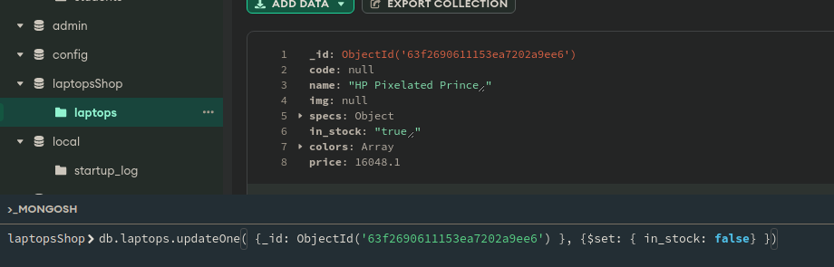
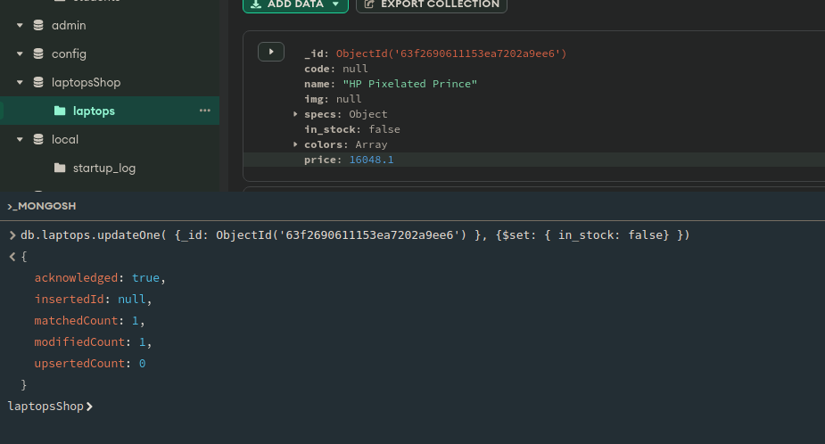
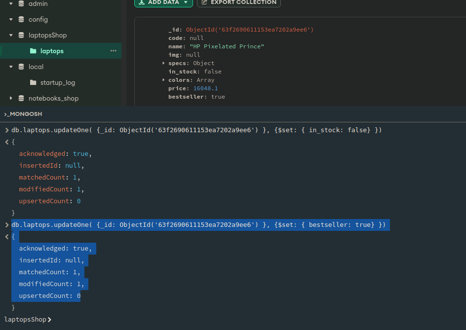
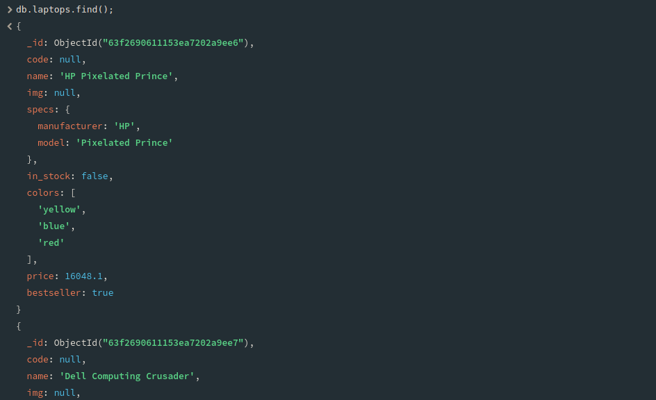

# Решение к Практическая работе №2.2. Документы и индексы в в `MongoDB`

## Задание 1. Создайте базу данных, с которой вы в дальнейшем будете работать

```javascript
use laptopsShop;
```

## Задание 2. Создайте коллекцию, в которой у вас будут храниться документы.

```javascript
db.createCollection("laptops");
```

## Задание 3. Наполните коллекцию документами в соответствии с вашим индивидуальным вариантом (см. Лабораторная работа №3). Создайте не менее 10 документов. Документы коллекции должны содержать, по крайней мере, один массив, и один вложенный документ.

> **Note**: Для выполнения данного пункта использовался скрипт `lab_4_laptops_docs_generator.py`, результат которого находится в файле lab_4_laptops_docs.json

## Задание 4. Создайте составной и полнотекстовый индексы для документов в вашей коллекции.

Запрос на создание составного индекса на основе полей `specs.manufacturer` и `in_stock`

```javascript
db.laptops.ensureIndex(
    {
        "specs.manufacturer": 1,
        "in_stock": 1
    }
);
```

Запрос на создание полнотекстового индекса

```javascript
db.laptops.ensureIndex(
    {
        "in_stock": 1
    }
);
```

Вывод индексов для коллекции `laptops`:

```javascript
db.laptops.getIndexes();
```

Результат:

```javascript
[
  { v: 2, key: { _id: 1 }, name: '_id_' },
  {
    v: 2,
    key: { 'specs.manufacturer': 1, in_stock: 1 },
    name: 'specs.manufacturer_1_in_stock_1'
  },
  { v: 2, key: { in_stock: 1 }, name: 'in_stock_1' }
]
```

## Задание 5. Создайте запрос, производящий замену документа.

> **Note**: см. Задание 6.

## Задание 6. Создайте запрос, производящий обновление любого поля документа и запрос, добавляющий в него новые поля.

Запрос на изменение значения поля `in_stock` для ноутбука с `_id=ObjectId('63f2690611153ea7202a9ee6')`:

```javascript
db.laptops.updateOne( {_id: ObjectId('63f2690611153ea7202a9ee6') }, {$set: { in_stock: false} });
```





Запрос на добавление поля `bestseller` для ноутбука с `_id=ObjectId('63f2690611153ea7202a9ee6')`:

```javascript
db.laptops.updateOne( {_id: ObjectId('63f2690611153ea7202a9ee6') }, {$set: { bestseller: true} });
```



## Задание 7. Создайте запрос для получения всех документов коллекции и определите, используется ли для него индекс.

Запрос для получения всех документов в коллекции `laptops`:

```javascript
db.laptops.find();
```



Команда для получения информации об обработке запроса

```javascript
db.laptops.find().explain();
```

Результат выполнения команды:

> **Note**: Запрос `db.laptops.find()` не использует индексы, т.к. мы не указали поля для фильтрации данных.
```javascript
{
  explainVersion: '1',
  queryPlanner: {
    namespace: 'laptopsShop.laptops',
    indexFilterSet: false,
    parsedQuery: {},
    queryHash: '17830885',
    planCacheKey: '17830885',
    maxIndexedOrSolutionsReached: false,
    maxIndexedAndSolutionsReached: false,
    maxScansToExplodeReached: false,
    winningPlan: {
      stage: 'COLLSCAN',
      direction: 'forward'
    },
    rejectedPlans: []
  },
  command: {
    find: 'laptops',
    filter: {},
    '$db': 'laptopsShop'
  },
  serverInfo: {
    host: 'fc62fc670621',
    port: 27017,
    version: '6.0.2',
    gitVersion: '94fb7dfc8b974f1f5343e7ea394d0d9deedba50e'
  },
  serverParameters: {
    internalQueryFacetBufferSizeBytes: 104857600,
    internalQueryFacetMaxOutputDocSizeBytes: 104857600,
    internalLookupStageIntermediateDocumentMaxSizeBytes: 104857600,
    internalDocumentSourceGroupMaxMemoryBytes: 104857600,
    internalQueryMaxBlockingSortMemoryUsageBytes: 104857600,
    internalQueryProhibitBlockingMergeOnMongoS: 0,
    internalQueryMaxAddToSetBytes: 104857600,
    internalDocumentSourceSetWindowFieldsMaxMemoryBytes: 104857600
  },
  ok: 1
}
```

Выполнив запрос `db.laptops.find({in_stock: true}).explain();` мы можем увидеть, что для него уже используется один индекс, созданный нами ранее `indexName: 'in_stock_1'`


```javascript
{
  explainVersion: '1',
  queryPlanner: {
    namespace: 'laptopsShop.laptops',
    indexFilterSet: false,
    parsedQuery: {
      in_stock: {
        '$eq': true
      }
    },
    queryHash: '0F47F5A6',
    planCacheKey: '0C7DB0A4',
    maxIndexedOrSolutionsReached: false,
    maxIndexedAndSolutionsReached: false,
    maxScansToExplodeReached: false,
    winningPlan: {
      stage: 'FETCH',
      inputStage: {
        stage: 'IXSCAN',
        keyPattern: {
          in_stock: 1
        },
        indexName: 'in_stock_1',
        isMultiKey: false,
        multiKeyPaths: {
          in_stock: []
        },
        isUnique: false,
        isSparse: false,
        isPartial: false,
        indexVersion: 2,
        direction: 'forward',
        indexBounds: {
          in_stock: [
            '[true, true]'
          ]
        }
      }
    },
    rejectedPlans: []
  },
  command: {
    find: 'laptops',
    filter: {
      in_stock: true
    },
    '$db': 'laptopsShop'
  },
  serverInfo: {
    host: 'fc62fc670621',
    port: 27017,
    version: '6.0.2',
    gitVersion: '94fb7dfc8b974f1f5343e7ea394d0d9deedba50e'
  },
  serverParameters: {
    internalQueryFacetBufferSizeBytes: 104857600,
    internalQueryFacetMaxOutputDocSizeBytes: 104857600,
    internalLookupStageIntermediateDocumentMaxSizeBytes: 104857600,
    internalDocumentSourceGroupMaxMemoryBytes: 104857600,
    internalQueryMaxBlockingSortMemoryUsageBytes: 104857600,
    internalQueryProhibitBlockingMergeOnMongoS: 0,
    internalQueryMaxAddToSetBytes: 104857600,
    internalDocumentSourceSetWindowFieldsMaxMemoryBytes: 104857600
  },
  ok: 1
}
```
