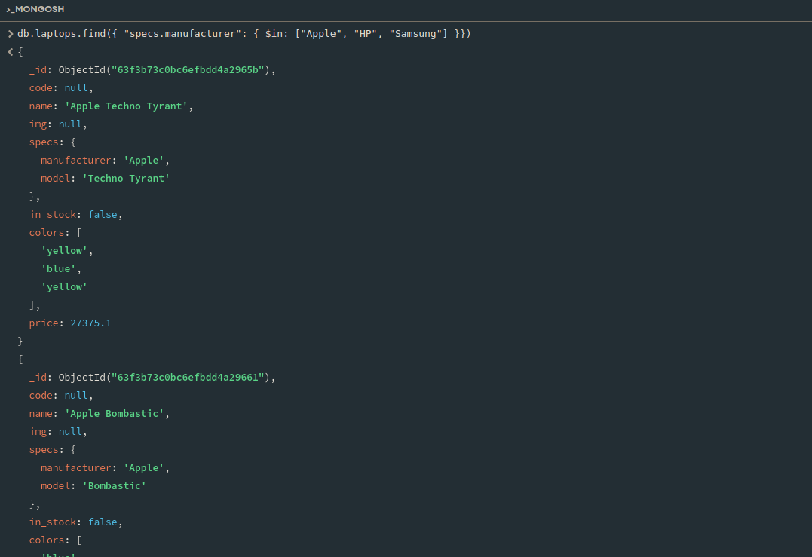

# Решение к Лабораторной работе №5. Запросы и запросы с условием `MongoDB`

## Задание 1. Создайте пару простых запросов для выборки данных из БД

- Запрос на выборку ноутбуков, производитель которых "HP":

    ```javascript
    db.laptops.find({ "specs.manufacturer": "HP" })
    ```
  
    

- Запрос на выборку ноутбуков, имеющихся в наличии:

    ```javascript
    db.laptops.find({ "in_stock": true })
    ```
  
    '

## Задание 2. Создайте сложные запросы с каждым из перечисленных модификаторов

- Запрос на выборку ноутбуков, у которых производитель "Apple" и он имеется в наличии

    ```javascript
    db.laptops.find({ "specs.manufacturer": "Apple", "in_stock": true })
    ```
    
    

- Запрос на выборку ноутбуков, у которых производитель "Apple" или "Samsung"
  
    ```javascript
    db.laptops.find({ $or: [{"specs.manufacturer": "Apple"}, {"specs.manufacturer": "Samsung"}] })
    ```
    
    

- Запрос на выборку количества ноутбуков до 10000.0 р
  
    ```javascript
    db.laptops.find({ "price": { $lt: 10000.0 }})
    ```
  
    

- Запрос на выборку количества ноутбуков от 15000.0 р

    ```javascript
    db.laptops.find({ "price": { $gt: 15000.0 }})
    ```
  
    

- Запрос на выборку количества ноутбуков НЕ от "Apple"

    ```javascript
    db.laptops.find({ "specs.manufacturer": { $ne: "Apple" }})
    ```
  
    

- Запрос на выборку количества ноутбуков, у которых производитель "Apple", "HP" или "Samsung"

    ```javascript
    db.laptops.find({ "specs.manufacturer": { $in: ["Apple", "HP", "Samsung"] }})
    ```

    

## Задание 3. Создайте запросы с использованием методов сортировки, ограничения и пропуска данных

- Запрос на выборку всех уникальных производителей ноутбуков, в алфавитном порядке (по возрастанию)

    ```javascript
    db.laptops.distinct("specs.manufacturer")
    ```
  
    

- Запрос на выборку топ 5 самых дорогих ноутбуков (по убыванию)

    ```javascript
    db.laptops.find({}, {"name": 1, "price": 1}).sort({"price": -1}).limit(5);
    ```
  
    

- Запрос на выборку топ 5 самых дешевых ноутбуков, пропустив 10 самых дешевых

    ```javascript
    db.laptops.find({}, {"name": 1, "price": 1}).sort({"price": 1}).skip(10).limit(5);
    ```
  
    